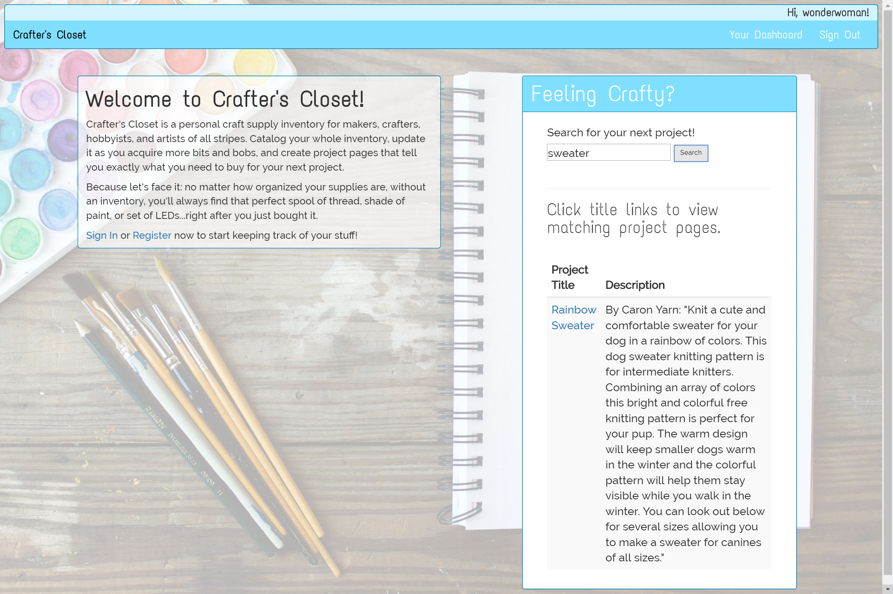
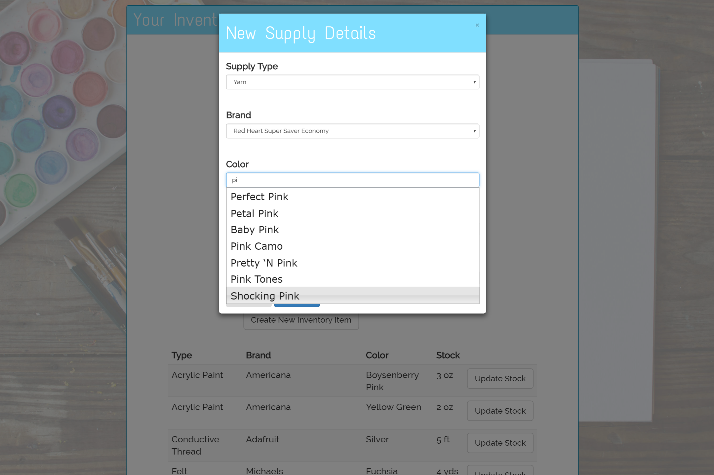

## Welcome to Crafter's Closet!

Crafter's Closet is an personal inventory tool for DIY/hobby/art supplies of 
all kinds. Once you tell Crafter's Closet how many pieces of a craft supply 
you own, the app figures out exactly how much of that supply you should buy to 
build a new project.

If you're authenticated, you'll have access to a dashboard where you can filter 
and search your inventory, add new supplies, update existing supplies, view a 
chart of the supply types you own, and view a list of your projects. When 
creating a project page, you can give general project details (title, 
description, and so on) as well as a list of supplies needed to build the 
project. When you view a project page while authenticated, Crafter's Closet 
shows how many of each required supply you would need to buy. Any user 
(authenticated or not) can also search the Crafter's Closet project pages to 
find fun crafts to make.

Want to try it yourself? Head to [www.crafterscloset.net](www.crafterscloset.net)!

## Tech Stack

Crafter's Closet uses the following technologies:

* PostgreSQL
* SQLAlchemy
* Python
* Flask
* Bcrypt
* Jinja
* JavaScript
* AJAX
* JQuery
* JQuery UI (Autocomplete Widget)
* Chart.js
* Bootstrap

## A Brief Tour
Now that you know what runs Crafter's Closet and what the app is supposed to 
do, let's take a quick look at how users can access this project's features.

### The Homepage

Here's the homepage, as viewed by an authenticated user:

An authenticated user can navigate to their dashboard from the homepage or 
anywhere else on the site, thanks to the Bootstrap navbar at the top. Both 
authenticated and unauthenticated users can search for projects and navigate 
to those project pages from here, too.

### The Dashboard

The user dashboard is where most of the magic happens in Crafter's Closet. This 
page is the hub for all your inventory-tracking needs, and it's where you can 
view projects you want to make.

#### Inventory Composition Chart

The chart below is powered by Chart.js.

Each slice of this doughnut chart roughly represents how much physical space a 
type of craft takes up in your inventory. For instance, wonderwoman--the demo 
user in all these screenshots--has 5 yds of felt (blue on the chart), which 
definitely take up a lot more space than the 18 tiny LEDs she owns (purple on 
the chart).

#### Inventory Table and Filter/Search Options

This section of the dashboard lets you decide which pieces of your inventory 
you actually want to see, as well as add new items and update your stock 
whenever you use an item.

The three dropdown filter menus have on-change events attached to them that ask 
for a version of the inventory table that only contains items matching those 
filters. (Search works the same way, but with arbitrary strings.) When you 
click an Update Stock button, JQuery plops a little text box down under your 
current stock amount, so you can type a new value. Click **Done!** to send that 
value to the database and update your table.

#### Adding a Supply

This wouldn't be much of an inventory app if you couldn't add new stuff to it! 
When you click Create New Inventory Item, a modal window drops down, showing a 
series of auto-populating dropdown menus and text fields.

Clicking the Supply Type button causes the Brand dropdown to fill with only 
brands from the database associated with that supply type. (That list is 
obtained via a GET request to the server, which passes the list forward after 
making a database query.) After you choose a brand, just start typing in the 
Color field for an autocompleted list of existing options that contain the text 
you're typing. Autocomplete comes courtesy of the JQuery UI library.

The autocomplete widget is hiding a quantity field and a units field; the units 
field always corresponds to the units associated with the chosen supply type.

#### Creating a New Project

To find out how many supplies you need to make a project, you have to create 
some project pages first. Here's what that page looks like.

Just add some basic details about your project, and start adding supplies. 
Selecting a supply type once again causes the Brand dropdown to auto-populate 
with relevant options, and choosing a brand does the same for colors. (I didn't 
want users to be able to choose colors that don't exist in the database for 
this part.) The other fields for the supply portion of the project form are the 
same as the forms from the modal window used to add supplies to your inventory.

There's a really cool button called Add a New Supply hiding behind the Color 
dropdown in this screenshot. When you click this button, Crafter's Closet uses 
JavaScript to generate a new copy of the supply form, so you can add an 
arbitrary number of supplies to your project.

#### The Project Page

Once you create a project, you'll be redirected to that project's shiny new 
landing page.

This screenshot shows a quote and photo from an amazing tutorial on Adafruit 
about making a color-changing scarf. The Supply Information table shows that 
wonderwoman needs to buy a little of two supply items listed for this project. 
The exact quantities to buy are calculated by a helper function written in 
Python.
